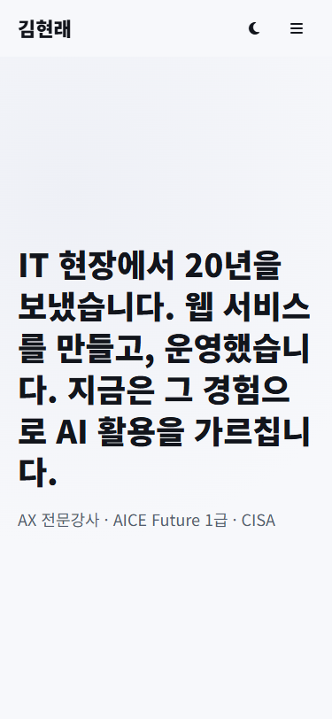
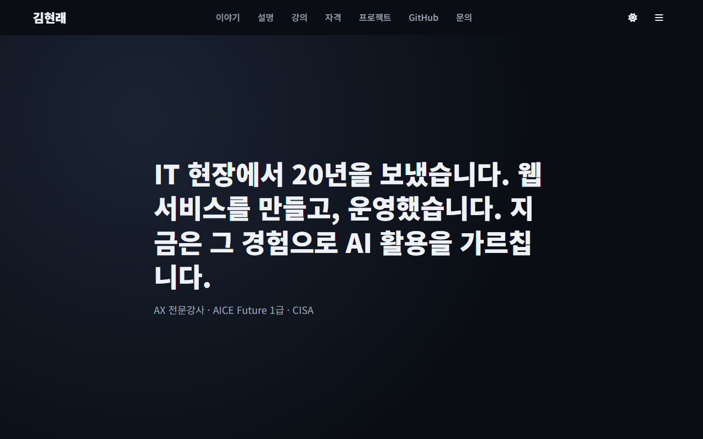

# MyPage

김현래 개인 홈페이지 겸 AX 전문강사 포트폴리오입니다. 코디세이 본과정 미션1
(순수 HTML/CSS/JS 포트폴리오) 과제를 겸해 제작했습니다.

방문자가 "이 사람은 뭐 하는 사람인가"를 알아가다가 자연스럽게 "강의를 맡겨도
되겠다"고 느끼도록, 개인 홈페이지를 먼저 두고 그 안에 포트폴리오를 담는
구조로 만들었습니다. hero → story(경력 5장면) → explain(설명 방식) →
teaching → credentials → work(프로젝트) → github → contact 순으로 이어지는
한 장짜리 스크롤 페이지입니다.

## 사용 기술

외부 UI 프레임워크·라이브러리를 사용하지 않았습니다. React/Vue/jQuery/
Bootstrap/Tailwind 등은 전혀 쓰지 않고, 순수 HTML5·CSS3·JavaScript(ES
Modules)만으로 구현했습니다.

- **HTML5** — 시맨틱 태그(header/nav/main/section/article/footer) 기반 마크업
- **CSS3** — CSS 변수 기반 디자인 토큰(라이트/다크 2세트), Flexbox, Grid
- **JavaScript (ES Modules)** — 프레임워크 없이 `data-*`/`id` 마운트 지점에
  직접 렌더링. `fetch`+`async/await`, `IntersectionObserver`, `localStorage` 사용
- **GitHub REST API** — `https://api.github.com/users/hyun02063185-AX-beginner/repos`
  연동으로 저장소 목록을 불러옵니다
- **Font Awesome**, **Google Fonts(Noto Sans KR)** — 미션 규칙상 허용된 두 외부
  리소스만 사용했습니다

## 배포

- **배포 URL**: https://hyun02063185-ax-beginner.github.io/MyPage/
- 이 저장소는 별도 빌드 단계가 없는 정적 사이트라 GitHub Pages의
  "Deploy from a branch"(브랜치: `main`, 폴더: `/ (root)`) 방식으로 배포합니다.

## 스크린샷

제출용 스크린샷 파일은 아래 경로에 넣으면 표시됩니다(현재는 자리만 잡아둔
상태입니다).

| 데스크톱 | 모바일 | 다크모드 |
|---|---|---|
|  |  |  |

## 인터랙션 임계값

미션 요구사항에 따라 3종의 임계값을 명시합니다(`js/motion/constants.js`에서
관리합니다).

| 인터랙션 | 임계값 |
|---|---|
| 스크롤탑 버튼 노출 | 스크롤 300px 이상 |
| 네비게이션 배경 전환 | 스크롤 60px 이상 |
| 등장 애니메이션(IntersectionObserver) | threshold 0.2 |

## 폴더 구조

```
MyPage/
├─ index.html          # 시맨틱 마크업. 콘텐츠는 없고 각 섹션의 마운트 지점만 정의
├─ css/
│  ├─ tokens.css        # 디자인 토큰 — :root(라이트) / [data-theme="dark"](다크)
│  ├─ base.css          # 리셋, 접근성 유틸리티, 등장 애니메이션 초기 상태(.reveal)
│  ├─ layout.css        # 헤더·네비·컨테이너 등 전역 레이아웃, 반응형 브레이크포인트
│  └─ sections.css      # 섹션별 컴포넌트 스타일(카드, 폼, 상태 패널 등)
├─ js/
│  ├─ main.js           # 초기화 함수·렌더 함수 호출 순서를 정리하는 진입점
│  ├─ data/             # 콘텐츠 데이터(문구·이미지 경로 등). 내용 수정은 여기만
│  ├─ render/           # 데이터를 DOM에 그리는 렌더 함수, GitHub API 연동, 폼 검증
│  └─ motion/           # 다크모드 토글·햄버거 메뉴·스크롤·등장 애니메이션 등 인터랙션
├─ images/              # 사이트에서 쓰는 WebP 이미지
├─ content/             # 프로젝트 카드 원본 자료(md, 15건). 참고용이며 렌더링에는
│                         js/data/projects.js를 사용
├─ SPEC.md              # 구현 스펙 — 섹션 구성·인터랙션 목록·데이터 스키마·검수 체크리스트
└─ CLAUDE.md            # 작업 규칙과 에이전트별 담당 경로를 정의한 문서
```
